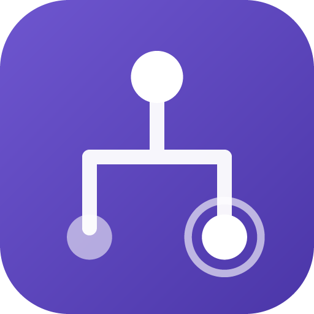
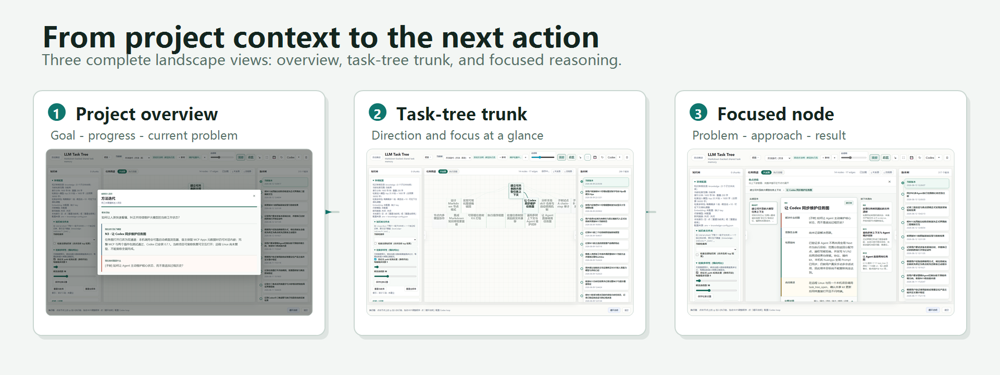
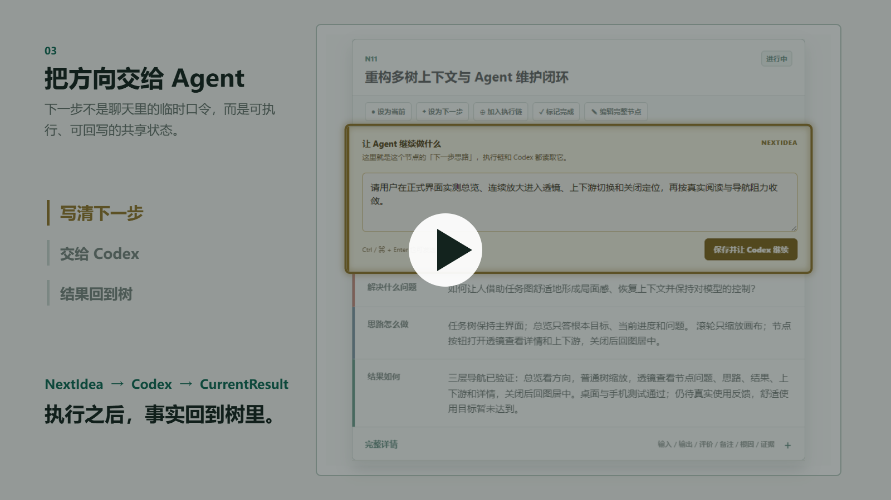
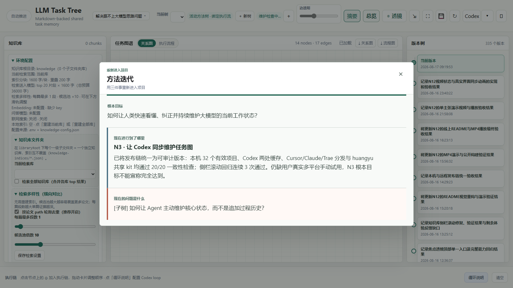
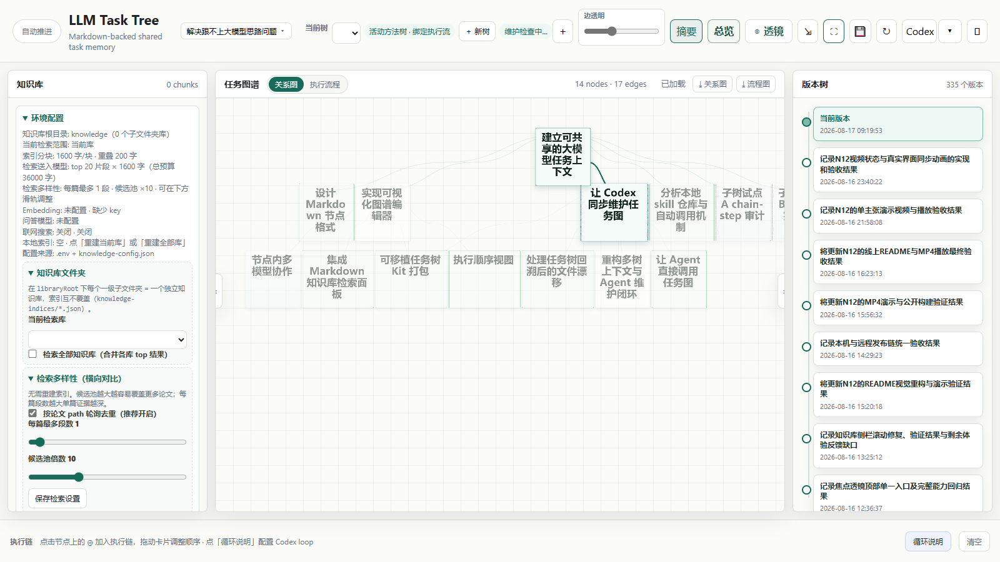
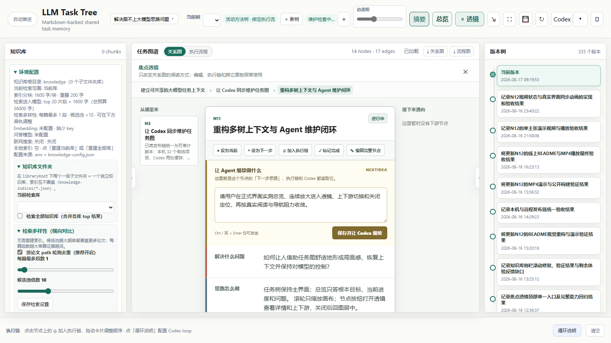
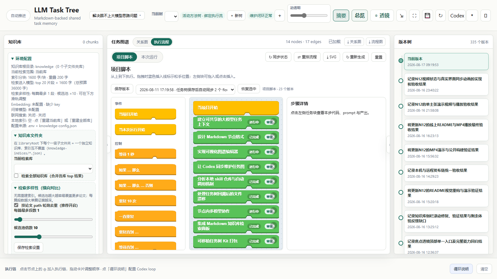
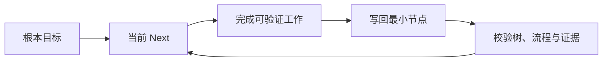

<div align="center">
  

# LLM Task Tree

**让长期项目，一眼回到正轨。**

把根本目标、当前进度、节点思路和真正的下一步，变成一棵人和 Agent 共同维护的本地任务树。

[快速开始](#五分钟开始) · [观看演示](#从全局到此刻) · [安装插件](#接入你正在使用的-agent) · [工作原理](#不是另一份聊天摘要)
</div>



## 从全局，到此刻。

不用重读几十轮对话。先看项目为什么存在、已经走到哪里、现在卡在哪里；再沿主干进入真正需要判断的节点。

<div align="center">
  <a href="https://cdn.jsdelivr.net/gh/guess-guess-who-i-am/llm-task-tree@main/artifacts/readme-demo.mp4">
    
  </a>
  <br />
<sub>20 秒看懂核心：先固定项目局面，再沿主干找到下一步，并把它交给 Agent 执行后回写结果。</sub>
</div>

## 新：上下文不会突然断掉

长项目最容易丢掉的，不是代码，而是 Agent 对“我们已经做到哪里”的连续理解。LLM Task Tree 现在会把每个并行分支当作一个可持续的工作上下文：

- **接近上限时先提醒，达到阈值后自动换代**：新对话不会带着整段历史继续膨胀。
- **自动生成短交接包**：包含根目标、阶段目标、当前结果、变更文件、测试和下一动作。
- **新一代在自己的 worktree 里实际读取交接**：不是只在界面上显示“已交接”。
- **旧对话归档而不是删除**：每个分支的代际、thread 和交接路径都可追踪。
- **分支完成后清理临时输入**：长期事实留在任务树和证据文件里，聊天历史不污染树。

这一轮已通过上下文生命周期、Codex 运行时、协调器、Git worktree、桌面/手机和真实 HTTP 浏览器回归。默认使用用户当前的 model 与 effort 配置；长期真实业务的连续性仍建议由使用者在自己的项目中连续试跑验证。

详情见 [`2026-08-19 上下文生命周期发布说明`](docs/releases/2026-08-19-context-lifecycle.zh.md)。

## 三层视野。一棵树。

### 先看根本目标。

项目总览只回答三件事：根本目标、现在进行到了哪里、现在的问题是什么。



### 缩小时，只看方向。

语义缩放保留阶段标题和粗主干。树再大，也能先判断哪条路线正在推进，而不是先读完每个节点。



### 走近一个节点，看清来龙去脉。

焦点透镜把一个节点的**问题、思路、结果、剩余差距和下一步**放在一起，同时保留上下游、执行链和编辑能力。



### 关系是地图，执行流程是顺序。

任务树表达问题之间为什么相关；执行流程单独表达先做什么、后做什么，并把步骤证据留在项目里。



## 不是另一份聊天摘要。

聊天负责眼前的协作，任务树负责长期项目的当前事实。

- **旧计划不会冒充下一步。** Agent 只执行 `GraphState.Next` 节点当前的 `NextIdea`；`NextPlan` 只是用户备忘。
- **结果必须回到目标。** 每次写回都说明已经具备什么、证据在哪里、还差什么，以及现在能否宣称目标达成。
- **多 Agent 不会争抢同一节点。** scope 为每个 Agent 分配执行目标和可写节点，公共焦点仍由用户掌握。
- **树里只留当前状态。** 历史进入 `versions/`，执行证据进入 `scripts/steps/`，避免任务图越用越长。
- **Markdown 是事实来源。** 图形界面、Agent 和执行流共同读写项目目录中的可审计文件。

## 五分钟开始

需要 Node.js 20.11 或更高版本。

```bash
git clone https://github.com/guess-guess-who-i-am/llm-task-tree.git
cd llm-task-tree/kit
npm start
```

Windows 也可以双击 `kit/打开任务图.cmd`。服务只监听本机地址，并为每个项目选择稳定端口。

接入 Agent 后，直接说：

```text
打开任务图，我要自己拖着看。
```

或让它从任务树恢复项目状态：

```text
读一下任务图现在的根本目标、进度、问题和下一步。
```

## 接入你正在使用的 Agent

同一个自足插件包位于 `marketplace/plugins/task-tree/`，Codex、Cursor 和 Claude Code 共用；Trae 使用标准 stdio MCP。

| 平台 | 安装入口 |
|---|---|
| **Codex** | `codex plugin marketplace add guess-guess-who-i-am/llm-task-tree` |
| **Claude Code** | `/plugin marketplace add guess-guess-who-i-am/llm-task-tree`，再运行 `/plugin install task-tree@llm-task-tree` |
| **Cursor** | 安装 `marketplace/plugins/task-tree/`，或部署后使用项目内 `.cursor/mcp.json` |
| **Trae** | 部署任务树后导入 [`integrations/trae/mcp.json`](integrations/trae/mcp.json) |

Codex 对话内嵌界面还需要在 `~/.codex/config.toml` 开启：

```toml
[features]
enable_mcp_apps = true
```

## 一份状态，贯穿协作。



Agent 先读取根本目标、当前节点和 `NextIdea`，完成一个可验证工作单元后立即写回最小相关节点。写入工具负责备份、紧凑度校验、焦点保护和执行流状态同步。

<details>
<summary><strong>查看 MCP 工具与协议</strong></summary>

| 职责 | 主要工具 |
|---|---|
| 查看 | `task_tree_open`、`task_tree_render`、`task_tree_focus`、`task_tree_node` |
| 更新 | `task_tree_write`、`task_tree_subtree`、`task_tree_layout` |
| 执行 | `task_tree_chain`、`task_tree_flow_status`、`task_tree_flow_write` |
| 多 Agent | `task_tree_scope` |
| 质量与历史 | `task_tree_check_compact`、`task_tree_versions` |
| 扩展能力 | `task_tree_knowledge`、`task_tree_models`、`task_tree_skills` |

项目接入块在 [`kit/templates/AGENTS.merge.md`](kit/templates/AGENTS.merge.md)，完整规则在 [`kit/AGENTS.task-tree.md`](kit/AGENTS.task-tree.md)。写入工具不能擅自移动 `Current`、`Next`，也不会执行 `NextPlan`。

</details>

<details>
<summary><strong>查看仓库结构</strong></summary>

```text
kit/                            可部署到项目的任务树运行时
marketplace/plugins/task-tree/  Codex、Cursor、Claude Code 共享插件
.agents/plugins/                Codex marketplace
.claude-plugin/                 Claude Code marketplace
integrations/trae/              Trae MCP 配置模板
artifacts/                      README 横屏媒体与演示视频
```

</details>

## 本地优先，也可以核查。

任务树服务默认只监听 `127.0.0.1`。任务图、版本、步骤证据和知识库保存在工作区；只有主动配置外部模型或联网检索时，相关请求才会发送到你选择的服务商。

视觉取舍与参考图提取过程记录在 [`docs/readme-design/apple-reference-style.md`](docs/readme-design/apple-reference-style.md)。

## License

[MIT](LICENSE) © LLM Task Tree contributors
