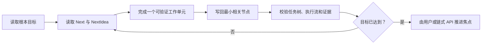

<div align="center">
  

# LLM Task Tree

**让人和 Agent 始终看见同一个目标、同一份进度和真正的下一步。**

把散落在长对话里的项目状态，变成可缩放、可纠正、可执行的本地任务图。

[快速开始](#快速开始) · [安装到 Agent](#安装到你的-agent) · [了解任务树](#为什么任务树不是聊天摘要) · [开发文档](#开发与验证)

[](#codex)
[](#cursor)
[](#claude-code)
[](#trae)
[](LICENSE)
</div>


## 为什么任务树不是聊天摘要

聊天擅长回答眼前的问题，却很难稳定承担长期项目状态：旧计划可能过期，阶段目标容易被局部实现淹没，多 Agent 还可能写错彼此的节点。

LLM Task Tree 把项目的**根本目标、阶段问题、解决思路、已验证结果和下一步**写进本地 Markdown 图谱。人从项目总览沿主干进入节点；Agent 通过 MCP 读取和更新同一份状态，不再依靠越来越长的聊天历史猜进度。

| 普通聊天记录 | LLM Task Tree |
|---|---|
| 按时间堆积，旧信息仍在影响后续判断 | 只保留当前有效状态，历史进入版本库 |
| 必须重读上下文才能恢复项目局面 | 总览直接回答目标、进度和当前问题 |
| “下一步”可能在多轮后已经过期 | 只执行 Next 节点当前的 `NextIdea` |
| 多 Agent 容易争抢同一焦点 | 每个 Agent 只执行和写回获授权节点 |

## 快速开始

需要 Node.js 20.11 或更高版本。克隆仓库后：

```powershell
npm start
```

Windows 也可以双击 `打开任务图.cmd`。服务会为项目选择稳定的本地端口并打开浏览器。

接入 Agent 后，直接说：

```text
打开任务图，我要自己拖着看。
```

或者让 Agent 恢复项目状态：

```text
读一下任务图现在的根本目标、进度、问题和下一步。
```

## 三种阅读尺度

| 视图 | 显示什么 | 回答什么问题 |
|---|---|---|
| 项目总览 | 根本目标、当前进度、当前问题 | 整个项目现在到哪了？ |
| 宏观任务树 | 阶段主干、焦点路径、方向性标题 | 接下来应该推进哪条路线？ |
| 焦点节点 | 问题、思路、结果、差距、下一步 | 这个节点究竟解决了什么？ |

### 核心能力

- **语义缩放**：缩小时只看主干和方向，放大后再看节点内容。
- **焦点透镜**：集中阅读当前节点、上下游和完整详情，关闭后回到原位置。
- **目标约束**：结果必须说明已具备的能力、剩余差距和目标能否宣称达成。
- **可靠执行**：只执行 `GraphState.Next` 节点当前的 `NextIdea`；`NextPlan` 仅作用户备忘。
- **多 Agent 隔离**：scope 限定每个 Agent 的执行节点和可写节点。
- **可追溯状态**：当前状态留在树中，历史进入 `versions/`，证据进入 `scripts/steps/`。
- **本地优先**：任务图、版本、执行流和知识库默认保存在项目目录。

## 安装到你的 Agent

同一个自足插件包位于 `marketplace/plugins/task-tree/`，供 Codex、Cursor 和 Claude Code 复用；Trae 使用标准 stdio MCP。

### Codex

```text
codex plugin marketplace add guess-guess-who-i-am/llm-task-tree-workspace-backup
```

然后在插件目录安装 `task-tree`。要在对话内显示交互界面，在 `~/.codex/config.toml` 开启：

```toml
[features]
enable_mcp_apps = true
```

不使用插件市场时，可以直接注册共享 kit：

```powershell
node .\llm-task-tree-kit\scripts\install-codex-mcp.mjs --with-plugin
```

### Cursor

部署任务树后提交项目里的 `.cursor/mcp.json`；它使用 `${workspaceFolder}` 启动当前项目的运行时。也可以把 `marketplace/plugins/task-tree/` 安装为本地插件，再执行 `Developer: Reload Window`。

### Claude Code

```text
/plugin marketplace add guess-guess-who-i-am/llm-task-tree-workspace-backup
/plugin install task-tree@llm-task-tree
```

Claude Code 会从仓库根的 `.claude-plugin/marketplace.json` 找到插件，并随插件启动 MCP 服务。

### Trae

先把 `llm-task-tree/` 部署到目标项目，再导入 [`integrations/trae/mcp.json`](integrations/trae/mcp.json)。详细步骤见 [`integrations/trae/README.md`](integrations/trae/README.md)。

## Agent 如何工作



协议入口是 [`AGENTS.md`](AGENTS.md)，完整规则在 [`llm-task-tree/AGENTS.task-tree.md`](llm-task-tree/AGENTS.task-tree.md)。

## MCP 工具

| 职责 | 主要工具 |
|---|---|
| 查看 | `task_tree_open`、`task_tree_render`、`task_tree_focus`、`task_tree_node` |
| 更新 | `task_tree_write`、`task_tree_subtree`、`task_tree_layout` |
| 执行 | `task_tree_chain`、`task_tree_flow_status`、`task_tree_flow_write` |
| 多 Agent | `task_tree_scope` |
| 质量与历史 | `task_tree_check_compact`、`task_tree_versions` |
| 扩展能力 | `task_tree_knowledge`、`task_tree_models`、`task_tree_skills` |

写入工具会自动备份、校验紧凑度并同步执行流；它不能擅自移动 `Current`、`Next` 或执行 `NextPlan`。

## 仓库结构

```text
task-tree.md                     当前项目的方法任务树
llm-task-tree/                   服务、前端、协议与 MCP 源码
llm-task-tree-kit/               可部署到其他项目的运行时 kit
marketplace/plugins/task-tree/   三平台共享插件
.agents/plugins/                 Codex marketplace
.claude-plugin/                  Claude Code marketplace
integrations/trae/               Trae MCP 配置模板
scripts/steps/                   可复核的执行证据
versions/                        任务树版本快照
```

## 数据与隐私

任务树服务默认只监听 `127.0.0.1`。树、执行证据、版本和本地知识库都保存在工作区；只有主动配置外部模型或联网检索时，相关请求才会发送到你选择的服务商。

## 开发与验证

```powershell
powershell -File scripts/build-readme-hero.ps1
node scripts/build-plugin-runtime.mjs
node scripts/test-plugin-manifest.mjs
node scripts/test-plugin-package.mjs
node scripts/build-public-repo.mjs
```

公开构建会扫描本机绝对路径和疑似凭据，发现泄漏便直接失败。修改插件运行时后，应同步提升三份插件 manifest 的版本并重新构建。

## License

[MIT](LICENSE) © LLM Task Tree contributors
