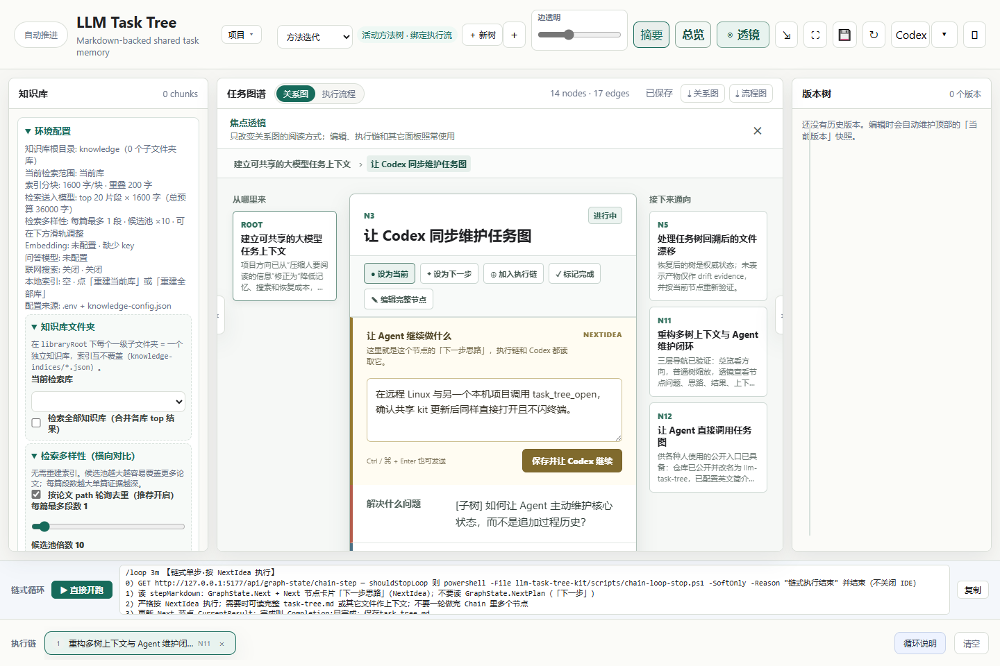
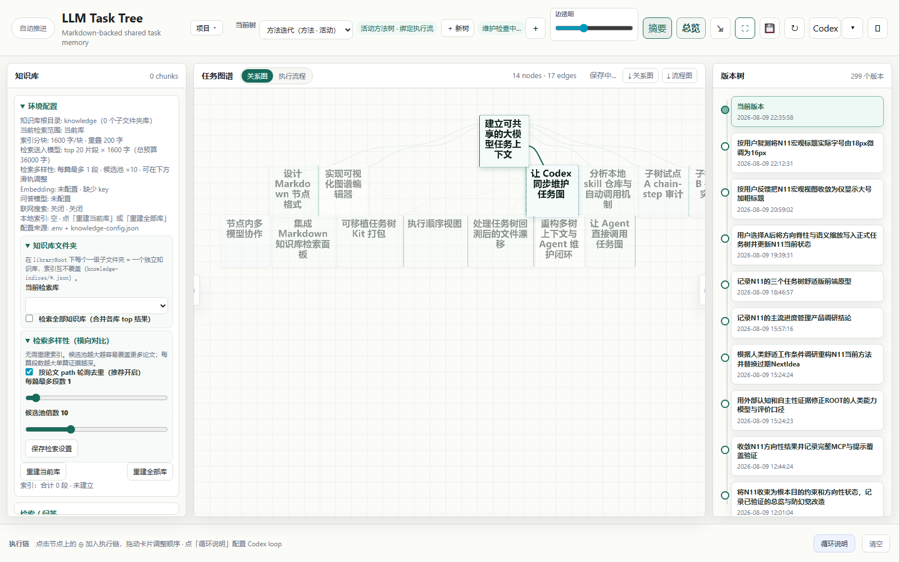
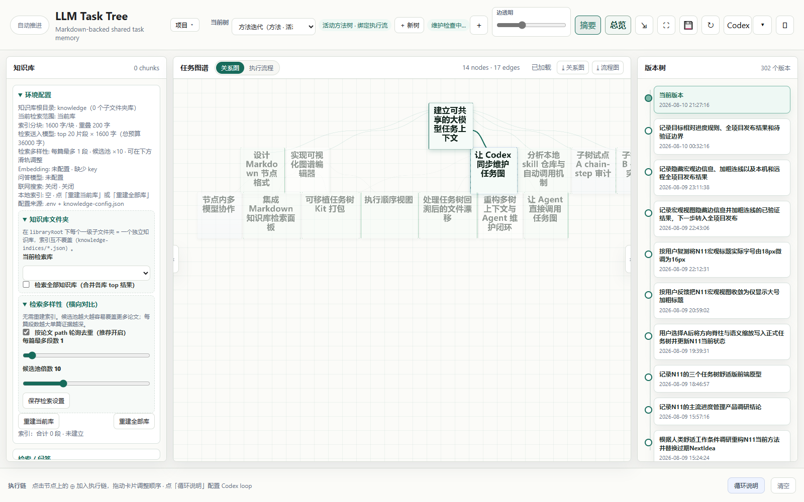
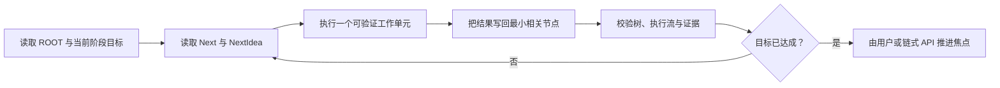

<div align="center">

# LLM Task Tree

**让人和 Agent 始终看见同一个目标、同一份进度和真正的下一步。**

把散落在长对话里的项目状态，变成可缩放、可追溯、可执行的本地任务图。

[](#codex)
[](#cursor)
[](#claude-code)
[](#trae)
[](#平台接入)
[](LICENSE)

</div>



## 为什么是任务树

聊天擅长回答眼前的问题，却很难稳定承担长期项目记忆：旧计划可能过期，阶段目标容易被局部实现淹没，多 Agent 还可能写错彼此的节点。

LLM Task Tree 把项目的**根本目标、阶段问题、解决思路、已验证结果和下一步**写进一份本地 Markdown 图谱。人可以从宏观主干一路缩放到节点细节；Agent 则通过 MCP 工具读取和更新同一份状态，而不是依靠越来越长的聊天历史猜测项目进度。

## 你会得到什么

- **语义缩放**：缩小时只保留主干和方向，放大后再显示“解决什么、怎么做、结果如何”。
- **焦点透镜**：聚焦当前节点时仍能查看详细信息，关闭后回到该节点在整张图中的位置。
- **目标约束**：结果必须回答根本目标或阶段目标，明确当前能力、剩余差距和能否宣称达成。
- **可靠执行**：执行依据是 `GraphState.Next` 节点的 `NextIdea`；容易过期的 `NextPlan` 只作用户备忘，绝不执行。
- **多 Agent 隔离**：每个 Agent 可获得独立 scope，只执行和写回获授权节点，不会争抢全局焦点。
- **过程与证据分离**：树只保留当前有效状态，历史进入 `versions/`，运行证据进入 `scripts/steps/`。
- **本地优先**：任务图、版本、执行流和知识库默认都在项目目录中；MCP 服务在本机运行。



## 平台接入

同一个插件包位于 `marketplace/plugins/task-tree/`，内含自足运行时、Skill 和 MCP 定义。需要 Node.js 20.11 或更高版本。

| 平台 | 接入方式 | 当前支持 |
|---|---|---|
| Codex / ChatGPT 桌面端 | 原生插件市场 | 插件、Skill、MCP Apps、本地网页 |
| Cursor | 原生插件或项目级 MCP | Skill、MCP、本地网页 |
| Claude Code | 原生插件市场 | Plugin、Skill、MCP、本地网页 |
| Trae | 项目级 stdio MCP | MCP、本地网页 |

### Codex

```text
codex plugin marketplace add guess-guess-who-i-am/llm-task-tree-workspace-backup
```

然后在插件目录安装 `task-tree`。若需要把交互界面直接显示在对话中，在 `~/.codex/config.toml` 开启：

```toml
[features]
enable_mcp_apps = true
```

不使用插件市场时，也可以运行 kit 中的注册脚本：

```powershell
node .\llm-task-tree-kit\scripts\install-codex-mcp.mjs --with-plugin
```

### Cursor

项目级使用时，把任务树部署到项目后提交 `.cursor/mcp.json`；Cursor 会通过 `${workspaceFolder}` 启动本项目的运行时。也可以把 `marketplace/plugins/task-tree/` 安装为本地插件，然后执行 `Developer: Reload Window`。

### Claude Code

在 Claude Code 中执行：

```text
/plugin marketplace add guess-guess-who-i-am/llm-task-tree-workspace-backup
/plugin install task-tree@llm-task-tree
```

仓库根的 `.claude-plugin/marketplace.json` 负责发现插件；启用后，插件声明的 MCP 服务会随插件启动。

### Trae

Trae 使用标准 stdio MCP。先把 `llm-task-tree/` 部署到目标项目，再导入 [`integrations/trae/mcp.json`](integrations/trae/mcp.json)。详细步骤见 [`integrations/trae/README.md`](integrations/trae/README.md)。

## 两分钟开始

完整工作区可直接启动：

```powershell
npm start
```

Windows 也可以双击 `打开任务图.cmd`。服务会为项目选择稳定的本地端口并打开浏览器。

接入 Agent 后，可以直接说：

```text
打开任务图，我要自己拖着看。
```

或者：

```text
读一下任务图现在的根本目标、进度、问题和下一步。
```

Agent 应先调用 `task_tree_focus`，只执行 Next 节点的 `NextIdea`，每取得一个可验证结果就写回最小相关节点。

## 一张图，三种阅读尺度

| 尺度 | 你看到的内容 | 适合回答的问题 |
|---|---|---|
| 项目概览 | 根本目标、当前进度、当前问题 | “整个项目现在到哪了？” |
| 宏观任务树 | 阶段主干、焦点路径、方向性标题 | “接下来应该推进哪条路线？” |
| 节点详情 | 问题、思路、结果、差距、下一步 | “这个节点究竟解决了什么？” |



## Agent 工作闭环



项目级协议入口是 [`AGENTS.md`](AGENTS.md)，完整规则在 [`llm-task-tree/AGENTS.task-tree.md`](llm-task-tree/AGENTS.task-tree.md)。

## MCP 工具

工具按职责分组，Agent 不需要直接解析或整段改写 Markdown：

| 类别 | 主要工具 |
|---|---|
| 查看 | `task_tree_open`、`task_tree_render`、`task_tree_focus`、`task_tree_node` |
| 更新 | `task_tree_write`、`task_tree_subtree`、`task_tree_layout` |
| 执行 | `task_tree_chain`、`task_tree_flow_status`、`task_tree_flow_write` |
| 多 Agent | `task_tree_scope` |
| 质量与历史 | `task_tree_check_compact`、`task_tree_versions` |
| 扩展能力 | `task_tree_knowledge`、`task_tree_models`、`task_tree_skills` |

写入工具会自动备份、校验紧凑度并同步执行流；它不能擅自移动 `Current`、`Next` 或执行 `NextPlan`。

## 仓库结构

```text
task-tree.md                     当前项目的方法任务树
llm-task-tree/                   服务、前端、协议与 MCP 源码
llm-task-tree-kit/               可部署到其他项目的运行时 kit
marketplace/plugins/task-tree/   Codex / Cursor / Claude Code 共享插件
.agents/plugins/                 Codex marketplace
.claude-plugin/                  Claude Code marketplace
integrations/trae/               Trae MCP 配置模板
scripts/steps/                   可复核的执行证据
versions/                        任务树版本快照
```

## 数据与隐私

任务树服务默认只监听 `127.0.0.1`。树、执行证据、版本和本地知识库保存在工作区；插件本身不要求云端账户。只有在你主动配置外部模型或联网检索时，相关请求才会发送到你选择的服务商，请按该服务商的隐私政策处理敏感数据。

## 开发与验证

```powershell
node scripts/build-plugin-runtime.mjs
node scripts/test-plugin-manifest.mjs
node scripts/test-plugin-package.mjs
node scripts/build-public-repo.mjs
```

构建公开分发时会扫描机器绝对路径和疑似凭据，发现泄漏便直接失败。修改插件运行时后应提升三份插件 manifest 的版本并重新构建。

## 状态与许可

项目仍在快速迭代，Windows 路径已经过最多实测；插件运行时和 MCP 本身使用 Node.js，Linux/macOS 可运行，但桌面启动器与安装体验仍需继续补齐。

本项目使用 [MIT License](LICENSE)。
